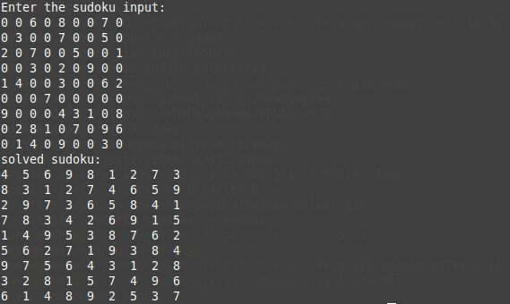

# Sudoku-Solver
A terminal-based app used to solve sudoku by backtracking.Backtracking is a general algorithm for finding all (or some) solutions to some computational problems, notably constraint satisfaction problems, that incrementally builds candidates to the solutions, and abandons a candidate ("backtracks") as soon as it determines that the candidate cannot possibly be completed to a valid solution.To learn more about backtracking, [click here](https://www.geeksforgeeks.org/backtracking-introduction/).

### How to use?
* Clone this repository.
* run sudoku_solver.cpp

##### Linux
Run the commands:
```
g++ sudoku-solver.cpp
./a.out
```

##### Windows
Run the executable file after compiling.

### How it works?
  
It takes the all the numbers of a sudoku as the input in the form of an array. All you have to do is to enter the allready filled numbers as they are there in the sudoku and zero's (0) in place of blank spaces. A screenshot of how it works is embedded below.


